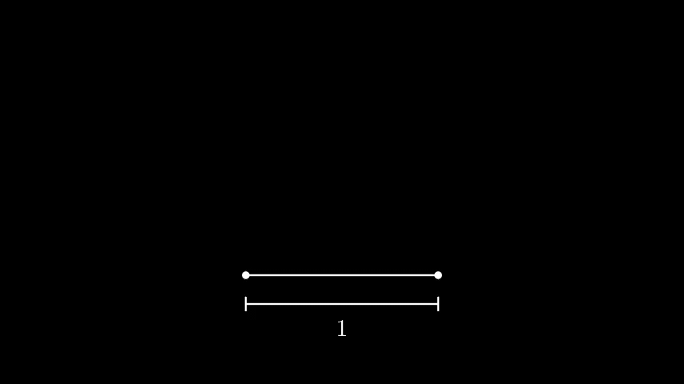

# `classnotes-html`
_markdown-to-html for lectures_

This is a pipeline for writing notes in markdown and converting them to pretty pseudo-LaTeX'd HTML. It comes with a custom style file, KaTeX, and some pre-defined environments and shorthands for things that I do. It is _very_ minimal compared to my LaTeX package [classnotes](https://github.com/neilrathi/classnotes).

Obviously there is a reasonable amount going on behind-the-scenes, but most of the work is done with pandoc. To transform a markdown doc into HTML, run
```bash
pandoc -c style.css --include-in-header header.html --katex --lua-filter=filter.lua -s FILE.md -o FILE.html
```

## Usage

There are four custom 'theorem-like' environments: `thrm`, `defn`, `postulate`, and `lemma`. Use \`\`\``env` delimiters to initialize these. Numbering is automatically incremented.

```defn
A loss function $J : \Theta \to \mathbf{R}$ is a _distance metric_ that quantifies how far functions parametrized by $\theta$ deviate in their output from an oracle.
```

Display math uses double dollar \$\$ wrappers. Say we have a function
$$
J(\theta) = \frac{1}{2N} \sum_{i=1}^{N} \left(h_{\theta}(x^{(i)}) - y^{(i)}\right)^2
$$
which we would like to minimize. We can do this in a Python code cell, wrapped with the \`\`\``python` delimiter as below:

```python
import numpy as np

X = np.array([[1, 1], [1, 2], [2, 2], [2, 3]])
y = np.array([6, 8, 9, 11])

w = np.zeros(X.shape[1])
lr = 0.01

for _ in range(1000):
    w -= lr * X.T.dot(X.dot(w) - y) / len(y)

print(w)
```

Tables and figures use standard markdown syntax. You can also use gifs.



Tables are rendered as in the `booktabs` package.

Column 1 | Column 2
----- | ------
hello | goodbye
wahoo | wahooo

## Implementation Details
Pandoc is doing most of the conversion. The `style.css` file contains all CSS used; most of this is standard. I use CSS3 counters to auto-number definitions/figures/etc. `header.html` imports important KaTeX information.

The Lua file `filter.lua` deals with converting shorthand environments into the underlying HTML divs. Code cells are implemented with [SageCell](https://sagecell.sagemath.org).
